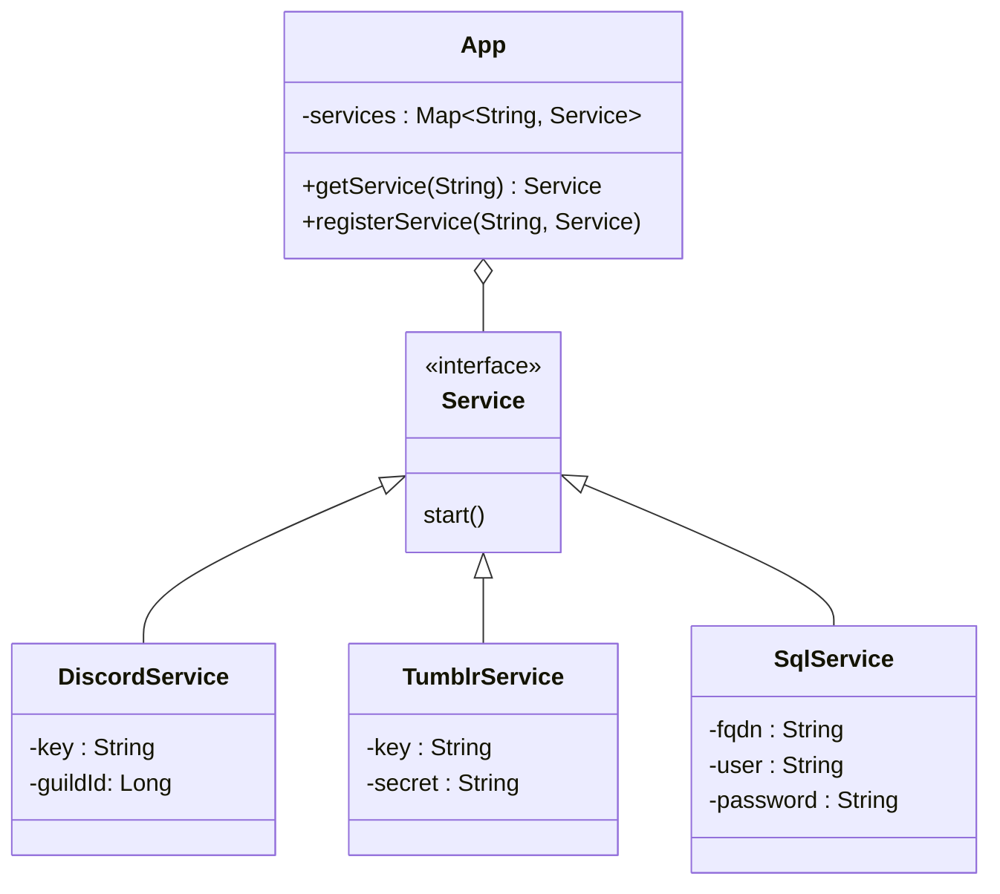

# Review by EcklerOChokola

## General remarks

Concerning the classes in Models, I would preferably create a Holder class that has all services in it and is then used by each service that needs it to be able to call any other service



This architecture could even be used to implement a general LoggerService, that ca be called in other places to create standardised logs

Maybe less methods in your services should be public, in order to limit the ways an user interacts with them

## Discord

In [this switch](https://github.com/Lucielle-Voeffray/TumblrFeed/blob/main/src/main/java/Models/Discord.java#L79), the flow

```java
String _2 = event.getOption(_1)
	.flatMap(ApplicationCommandInteractionOption::getValue)
    .map(ApplicationCommandInteractionOptionValue::asString)
    .get();
```

is repeated multiple times, and could be factorised for future uses. One such factorisation could look like the following : 

```java
private String getEventFieldByName(
	event: ChatInputInteractionEvent,
	name: String
) throws NoSuchElementException {
	return event.getOption(name)
		.flatMap(ApplicationCommandInteractionOption::getValue)
        .map(ApplicationCommandInteractionOptionValue::asString)
        .get();
}

...
String _2 = getEventFieldByName(event, _1)
...
```

Same thing can be said for the use of `ApplicationCommandOptionData.builder()`, which is used multiple times with the same types of arguments and the same arguments, and can be factorised to make further development easier.

## SQL 

Same thing as Discord, some methods use the same code multiple times, e.g. the SQL state check in the `SQLException` catch block.

## Cypher

The method [exec](https://github.com/Lucielle-Voeffray/TumblrFeed/blob/main/src/main/java/services/Cypher.java#L39) is deprecated as of Java18.

The method exec should instead be used with an array of String, as such :  
```java
String[] toImport = { "gpg", "--import", pubKey };
```  
, and the method could return early in the try/catch flow :   
```java
try {
	return Runtime.getRuntime().exec(toImport) != null;
} catch (IOException e) {
	System.out.printf(...);
	return false;
}
```

At [line 56](https://github.com/Lucielle-Voeffray/TumblrFeed/blob/main/src/main/java/services/Cypher.java#L56), the `String.format` should have the format in simple quotes, see [the sh manual page](https://linux.die.net/man/1/sh)

*Minor optimisation*  
At [line 65](https://github.com/Lucielle-Voeffray/TumblrFeed/blob/main/src/main/java/services/Cypher.java#L65), use `.append(s + "\n")` instead of two append calls to reduce the number of calls
